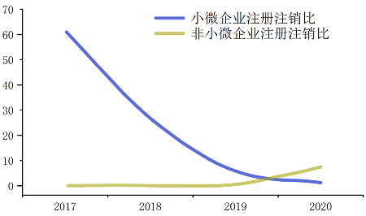
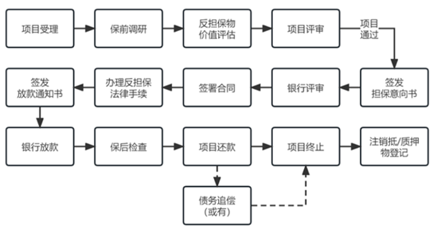
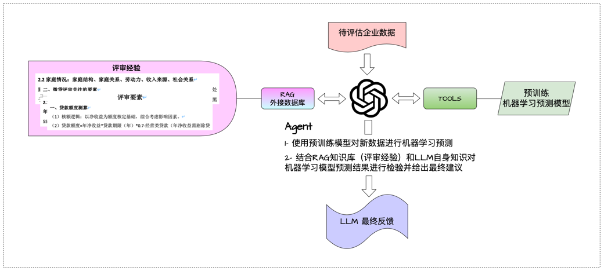
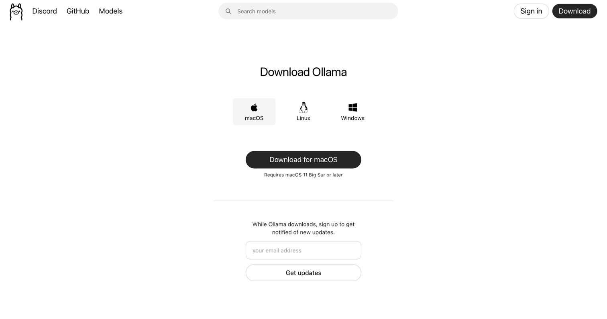
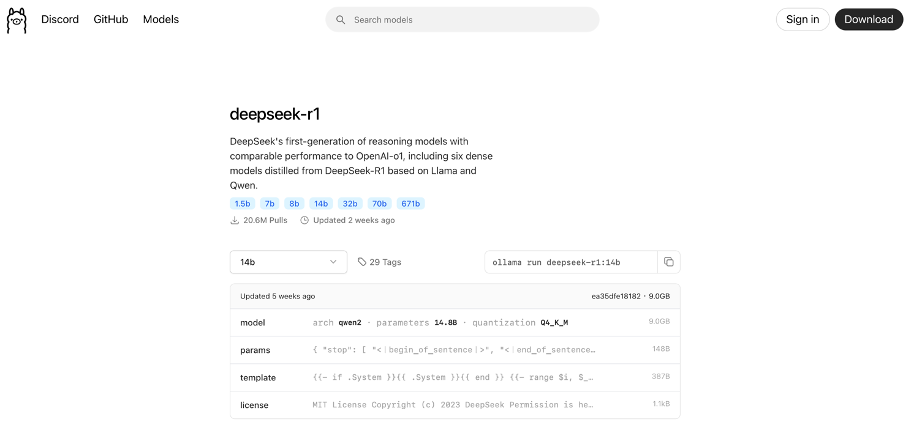
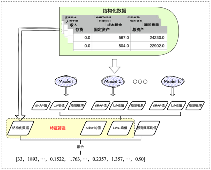

# SME_funding_guarantee_shantou

## BackGroud

​	中小微企业作为国家经济的重要组成部分，不仅在促进经济增长、推动技术创新、增加就业机会等方面发挥着不可替代的作用，还是市场经济活力的源泉。然而，近年来，中小微企业也面临融资难、市场竞争力弱、管理水平低等问题引起的生存与发展困境。由于中小微企业规模相对较小、信用记录不健全、抵押物不足等因素，导致其难以从传统金融机构获得足够的资金支持，进而影响了其经营发展和市场竞争力，成为制约其生成发展的关键瓶颈（图1-1）。

					

                    图1-1 中小微企业注册注销比

​	针对中小微企业的融资难题，融资担保作为一种有效的风险分担机制，成为解决中小微企业融资难的主要工具。通过引入第三方担保机构，为中小微企业提供信用增强，降低了金融机构的贷款风险，从而提高了中小微企业的融资成功率。然而，当前融资担保业务在实践中也面临着一系列问题，如过度依赖专家经验、评审流程长、评审主观性强、担保数据经验共享难等，这些问题严重制约了融资担保业务的有效开展和中小微企业的融资便利性（图1-2）。



                        图1-2 中小微企业担保流程
​	为了克服传统融资担保业务中的不足，提高中小微企业融资担保的效率和准确性，探索使用数据驱动的方式进行中小微企业融资担保评估显得尤为重要。数据驱动的方法能够充分利用历史数据，借助机器学习等技术对中小微企业的信用状况、经营能力、发展前景等进行全面、客观、精准的评估，从而为融资担保决策提供科学依据。


## 项目1-基于LLM辅助预测
该项目具体框架如图2所示，共分为两个版本：API调用LLM与本地部署LLM


                            图2 项目1、2的算法框架图
## 项目1-1-Agent辅助预测-API
使用该项目代码可调用LLM官方API进行汕头市中小微企业融资担保评估（包含结构化数据模型、文本数据、历史经验）
self.row 表示的是选择待测数据集中第x行的数据
将API存储到env文件中,使用os调用API和URL地址。以下以deepseek为例：
``` python
load_dotenv()
os.environ['OPENAI_API_KEY'] = os.getenv('DeepSeek_trans_API')  # 设定API密钥
os.environ["OPENAI_API_BASE"] = 'https://tbnx.plus7.plus/v1'  # 设定URL地址
```

## 项目1-2-Agent辅助预测-本地部署
使用该项目代码可使用本地部署LLM进行汕头市中小微企业融资担保评估，保障数据隐私安全，完全本地化
self.row 表示的是选择待测数据集中第x行的数据。
### 首先本地部署LLM：
#### 1.官网下载安装 OLLAMA:
`https://ollama.com/download`


#### 2. OLLAMA官网下载LLM模型（以DeepSeek-r1 14b模型为例）

官网下载对应版本：


终端运行 `ollama run deepseek-r1:14b`

#### 3. 代码中读取模型

    `self.model = Ollama(model="deepseek-r1:14b") `

## 项目3-LEAF算法-特征增强预测
使用该代码可进行特征扩充，并进行汕头市中小微企业融资担保评估。代码框架如下：




